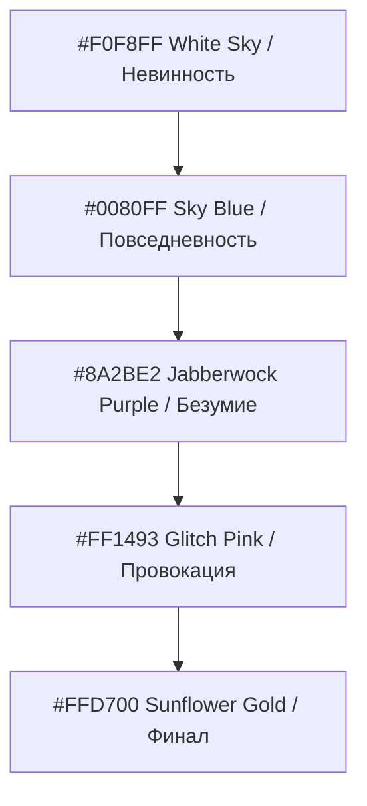

# Subarashiki Hibi: Solipsism-Punk
> **Дизайн-концепт интерактивного веб-сайта по мотивам культовой визуальной новеллы «Subarashiki Hibi» (Wonderful Everyday)**
> 
> *Эстетика безумия, философия Витгенштейна и расколотый мир через призму ультрадинамичного UI Persona-серии и Metaphor: ReFantazio.*

---

## 1. Анализ референсов (Общее / Необщее)

Чтобы создать по-настоящему революционный дизайн, мы проанализировали представленные интерфейсы (**Persona 5, Persona 3 Reload, Metaphor: ReFantazio** и концепт **Sweet Dreams**).

### Общие черты (Фундамент стиля Persona)
*   **Динамическая асимметрия (Tilted Axes):** Никаких статичных сеток 90°. Интерфейс строится по диагональным осям (наклон 15°–25°). Это создает кинетический драйв, ощущение нестабильности и постоянного движения.
*   **Персонаж как часть структуры:** Арт персонажа — не просто декорация, а доминантный композиционный элемент (занимает до 50% площади). Он перекрывает текст меню или сам перекрывается им, создавая глубокую многослойность.
*   **Ультраконтрастный минимализм палитры:** Использование 2-3 основных цветов, доведенных до абсолютного контраста (Red + Black + White в P5, Deep Blue + Neon Cyan + White в P3R).
*   **Типографика как графический объект:** Шрифты имеют огромный кегль, агрессивный наклон, наползают друг на друга, выходят за края экрана и служат главным носителем характера игры.
*   **Коллажная многослойность (Decollage):** Использование острых скосов, масок, геометрических осколков и эффектов «рваной бумаги» или «битого стекла».

### Различия (Уникальные фишки каждого стиля)

| Параметр | Persona 5 (Красный) | Persona 3 Reload (Синий) | Metaphor (Бирюзово-алый) | Sweet Dreams (Зеленый) |
| :--- | :--- | :--- | :--- | :--- |
| **Атмосфера** | Бунтарская, панковская, уличный гранж | Меланхоличная, «водная», фаталистическая | Живописная фэнтези-драма, экспрессионизм | Мечтательная, уютно-одинокая, интимная |
| **Текстуры** | Трафареты, газетные вырезки, звезды, полутона | Гладкие цифровые градиенты, стекломорфизм | Мазки масляной краски, текстура холста, брызги туши | Гладкий чистый вектор, мягкие тени |
| **Шрифты** | Хаотичный "ransom note" (буквы разного размера и стиля) | Чистый, технологичный наклонный гротеск (sans-serif) | Тяжелые акцидентные шрифты с засечками (serif/slab) | Аккуратный геометрический гротеск |

---

## 2. Концепция для Subarashiki Hibi: «Solipsism-Punk»

«Subarashiki Hibi» — это история о зыбкости реальности, безумии, бабочках, небесах и падении с крыши. 
Наш концепт **«Solipsism-Punk» (Солипсизм-панк)** соединяет меланхоличную философию Людвига Витгенштейна с агрессивным и стильным интерфейсом. Мы превращаем идею *«мир — это лишь мое представление»* в визуальный взрыв.

### Ключевые метафоры дизайна:
1.  **Осколки разбитого зеркала (Fractured Reality):** Мир расколот на главы и точки зрения. Весь интерфейс состоит из острых диагональных осколков стекла, которые сдвигаются и меняют отражение при наведении.
2.  **Смерть и Возрождение Бабочки (The Butterfly Effect):** Вместо звезд Persona 5, сквозь экраны летят стаи неоновых синих бабочек, оставляющих за собой глитч-шлейф.
3.  **Падающее небо (Falling Sky):** Использование глубоких синих градиентов, переходящих в золотой закат или кроваво-красный психоделический пурпур.
4.  **«Логико-философский трактат» как графический шум:** Цитаты Витгенштейна на немецком и русском языках мелким полупрозрачным шрифтом плывут по экрану, создавая текстурную подложку в стиле Metaphor: ReFantazio.

---

## 3. Дизайн-система (Цвета и Шрифты)

### Цветовая палитра (The Solipsistic Spectrum)
Мы берем знаковые цвета из ключевых глав новеллы:



*   **Sky Blue (`#0080FF`) & Pure White (`#FFFFFF`):** Базовые цвета неба. Символизируют главу *«Down the Rabbit-Hole»*, невинность, школьные дни.
*   **Jabberwock Purple (`#4B0082`):** Цвет вечерней школы, шизофрении Такудзи, мистики и надвигающегося апокалипсиса.
*   **Glitch Pink / Magenta (`#FF1493`):** Провокационный, неоновый розовый. Символ сексуального напряжения, ментального насилия и глитч-эффектов сломанного сознания.
*   **Sunflower Gold (`#FFD700`):** Теплый, глубокий цвет закатного солнца и бескрайнего поля подсолнухов. Наша надежда и финал *«Wonderful Everyday»*.

### Типографика (Typography)
*   **Заголовки (Акциденция):** **`Outfit`** или **`Syne`** (Google Fonts) — сверхжирные, геометрические шрифты с экстремальным наклоном (`transform: skewX(-15deg)`). Для некоторых психоделических элементов используется кастомный трафаретный шрифт, имитирующий вырезки.
*   **Текст меню:** **`Unbounded`** — футуристичный, широкий гротеск, плотно сбитый в блоки, перекрывающие друг друга.
*   **Философские цитаты (Шум):** **`EB Garamond`** — классическая антиква, отсылающая к печатным изданиям книг начала XX века.

---

## 4. Архитектура и Структура страниц сайта

Сайт функционирует как единое бесшовное SPA (Single Page Application) с кинетическими переходами между экранами.

```
                  ┌──────────────────────┐
                  │   00. DOWN THE WEB   │  <-- Входной экран (Кролик на фоне падающего неба)
                  └──────────┬───────────┘
                             ▼
                  ┌──────────────────────┐
                  │    01. MAIN MENU     │  <-- Главное меню (В стиле Persona 3/5)
                  └────┬───┬───┬────┬────┘
        ┌──────────────┘   │   │    └──────────────┐
        ▼                  ▼   ▼                   ▼
┌──────────────┐ ┌──────────────┐ ┌──────────────┐ ┌──────────────┐
│  02. CHARS   │ │  03. TRACTAT │ │ 04. CHAPTERS │ │  05. MUSIC   │
│  (Персонажи) │ │ (Философия)  │ │   (Сюжет)    │ │   (Плеер)    │
└──────────────┘ └──────────────┘ └──────────────┘ └──────────────┘
```

### Экран 1: Вход («Down the Rabbit-Hole»)
*   **Визуал:** Белое минималистичное пространство с силуэтом черного кролика, падающего вниз сквозь бесконечный тоннель из цитат.
*   **Действие:** При клике в любой точке экран «раскалывается» со звуком бьющегося стекла, и осколки складываются в Главное Меню.

### Экран 2: Главное Меню (The Core UI)
*   **Композиция (в духе Persona 3 Reload):** 
    *   Слева — Юки Минаками в культовой позе (курит на фоне неба), нарисованная в контрастной векторной манере (сине-белые тона, ярко-розовые тени).
    *   По центру/справа — огромные, наклоненные под углом 20° пункты меню: **`PLAY`**, **`CHARACTERS`**, **`TRACTATUS`**, **`CHAPTERS`**, **`SOUNDTRACK`**.
    *   Выбранный пункт загорается неоновым розовым (`#FF1493`), а под ним взрывается мазок золотой краски (в духе Metaphor: ReFantazio), обнажая скрытый арт подсолнухов.
    *   На бэкграунде медленно плывут 3D-осколки стекла, отражающие облака.

### Экран 3: Characters (Интерактивные Архетипы)
*   При выборе персонажа экран резко меняет цветовую гамму:
    *   **Юки:** Небесно-голубой и белый. Спокойствие, сигаретный дым, бабочки.
    *   **Такудзи:** Кроваво-фиолетовый и черный. Глитчи, безумные глаза, искажение текста (эффект линзы).
    *   **Хасаки:** Золотисто-желтый и изумрудный. Солнечные блики, плюшевый мишка, мягкие тени.
*   Характеристики персонажей выводятся в виде наклонных блоков, напоминающих статы из Persona (Skill, Item, Status).

### Экран 4: Tractatus (Философский глитч-арт)
*   Интерактивная стена с высказываниями Людвига Витгенштейна.
*   Пользователь может «двигать» трехмерные блоки текста. При наведении на цитату, буквы распадаются на пиксели или превращаются в бабочек, демонстрируя солипсическое разрушение языка.

---

## 5. Микроанимации и Интерактивные Эффекты (WOW-фичи)

Интерфейс должен ощущаться живым, опасным и невероятно отзывчивым:

1.  **Parallax Shard Effect (Эффект осколков):** Мы используем библиотеку `Three.js` (или продвинутый CSS 3D), чтобы создать слой парящих стеклянных осколков. Они реагируют на движение мыши, преломляя бэкграунд.
2.  **Kinetic Hover (Кинетическое наведение):** Когда курсор наводится на пункт меню, текст резко сдвигается вперед по оси Z, а фоновый силуэт персонажа меняет позу или выражение лица (например, Юки приоткрывает глаза, Такудзи безумно улыбается).
3.  **Glitch Transitions (Глитч-переходы):** Смена экранов происходит через быстрый, агрессивный глитч-эффект: белый шум, смещение RGB-каналов (RGB split) и резкий сдвиг плашек интерфейса в противоположные стороны.
4.  **Liquid Typography (Жидкая типографика):** Заголовки разделов при переходе плавно «перетекают» из одной формы в другую (с помощью SVG-фильтров деформации), создавая ощущение сна или бреда.

---

## 6. Звуковое сопровождение (Persona-style Audio)

Интерфейс Persona славится своими сочными звуковыми эффектами. Наш сайт получит полноценный интерактивный аудио-пакет:
*   **Ховер меню:** Хлесткий звук взмаха крыльев бабочки (высокочастотный "флаттер") или короткий стеклянный звон.
*   **Клик/Выбор:** Громкий, сочный звук бьющегося зеркала (Glass Shatter) смешанный с плотным аналоговым битом.
*   **Фоновый эмбиент:** Lo-Fi ремикс на культовую тему *«Yoru no Himawari»* (Подсолнухи ночью), сыгранный на кислотном джазовом пианино с глубоким басом в стиле Shoji Meguro (композитора Persona).

---

## 7. Технологический стек реализации

Для воплощения этого шедевра в коде мы рекомендуем:
1.  **База:** React + Vite (для молниеносной сборки и модульности).
2.  **Стилизация:** Vanilla CSS / CSS-in-JS (Styled Components) с жестким использованием CSS-переменных для динамической смены тем (смена протагонистов).
3.  **Анимации:** `Framer Motion` (для кинетических наклонных переходов и физики плашек) + `GSAP` (для сложнейшей покадровой анимации текста).
4.  **3D/Эффекты:** `React Three Fiber` / `Three.js` для рендеринга осколков стекла с преломлением света (Refraction mapping).

---

> ### ❞ *«Мир и жизнь суть одно. Я есмь мой мир. (Солипсизм)»* 
> — Людвиг Витгенштейн, «Логико-философский трактат» 5.621/5.63
