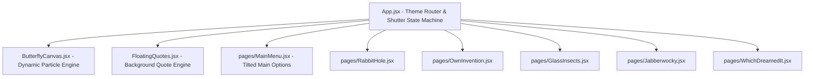

# Subarashiki Hibi "Solipsism-Punk" SPA - Technical Documentation

Welcome to the technical documentation of the **Subarashiki Hibi (Wonderful Everyday) Solipsism-Punk SPA**, a high-fidelity visual experience developed with React, Vite, and Vanilla CSS. 

The application utilizes advanced JRPG design paradigms inspired by modern Atlus menus (*Persona 3/5* and *Metaphor: ReFantazio*) combined with the psychological, solipsistic visual aesthetics of *Subarashiki Hibi*.

---

## 1. Design System & Global Styles

All styling is built around scoped CSS variables in `src/index.css`. The application supports **six distinct visual themes** (Main Menu and Chapters 1 to 5) that dynamically swap color variables, typography, backdrop filters, tilts, borders, and animations as the user navigates.

### Theme Palette Summary
*   **Theme 0 (Midnight Void - Main Menu)**: Cyber-cyan and hot-pink highlights on deep midnight blue backdrops. Skew angle `-12deg`.
*   **Theme 1 (Down the Rabbit-Hole)**: Sweet Dream pastel-mint (`#3EB489`) and soft pink. Skew angle `-12deg`. Clean elegant serif typography.
*   **Theme 2 (It's my Own Invention)**: Toxic acid-green (`#7FFF00`) and hot-pink glitch punk on pure pitch-black backdrops. Skew angle `-15deg`. Monospace glitch typeface.
*   **Theme 3 (Looking-glass Insects)**: Cyan velvet and gold light gradients over dark olive backdrops. Skew angle `+15deg`. Bold sans-serif typography.
*   **Theme 4 (Jabberwocky I)**: Theatrical copper-sand (`#d4a373`) and bright crimson-red brutalism. Skew angle `-12deg`. Heavy industrial styling.
*   **Theme 5 (Which Dreamed It)**: Clean Crimson and ice-blue minimalist dualism. Skew angle `-10deg`. Modern avant-garde spacing.

### Scanline CRT & Flicker
A global overlay `.global-overlay` applies a CRT scanline pattern and red/green/blue subpixel chromatic aberration lines at `0.03` opacity. During **Chapter 2 (Own Invention)**, this overlay increases opacity to `0.07` and animates a high-speed `.crt-flicker` animation to enhance the digital schizoid atmosphere.

---

## 2. Core Architectural Components

The application structure is fully modular:

### **A. Global Router & Shutter Machine (`src/App.jsx`)**
Coordinates the SPA's navigation. Instead of traditional route loading, it handles routing via an integrated **JRPG 5-Stripe Shutter Transition Engine**. When a user selects a chapter:
1.  **Entering (650ms)**: Transition stripes fall from top (`translateY(-180%)` to `translateY(0)`) at `-24deg` with staggered delays (`0s` to `0.16s`).
2.  **Separating (600ms)**: The non-selected stripes fall down and fade out. The selected chapter stripe straightens to `0deg` and expands to `140vw` and `left: -20vw` to cover the screen. During this expansion, a high-contrast JRPG title reveal card pops in.
3.  **Exiting (400ms)**: The entire overlay fades out smoothly, revealing the newly loaded page.
4.  **Idle**: The overlay is hidden, and stripes instantly snap back to the top off-screen positions (`translateY(-180%)`) with `transition: none !important` to prevent sliding back up.

### **B. HTML5 Dynamic Particle Engine (`src/components/ButterflyCanvas.jsx`)**
A custom high-performance HTML5 Canvas-based background.
*   Spawns floating triangular "glass shards" and cyber-butterflies that drift upwards.
*   Colors of the particles adapt in real-time to match the active chapter's `--primary-color` and `--secondary-color`.
*   Includes canvas resize throttling and requestAnimationFrame rendering for buttery smooth 60fps performance with negligible CPU/GPU overhead.

### **C. Background Floating Quotes Engine (`src/components/FloatingQuotes.jsx`)**
Fades deep philosophical quotes from Ludwig Wittgenstein's *Tractatus* and *Subahibi* characters in random corners.
*   Keeps a pool of 14 thematic quotes.
*   Automatically selects a random quote, coordinate position, and rotation angle (`-6deg` to `+6deg`) at 7-second intervals.
*   Adapts typeface, color, and drop-shadows instantly to match the active chapter theme.
*   Rendered at a highly transparent `0.08` opacity to enrich the background texture without interfering with page text readability.

---

## 3. Dynamic Chapter Pages & Layout Modes

Each chapter page in `src/components/pages/` supports **three interactive visual styles** which the user can toggle instantly via a custom JRPG sub-header navigation:

1.  **Chapter 1 (Down the Rabbit-Hole)**:
    *   *Bento Diary*: Modular grids displaying journal logs and character stats.
    *   *Novel HUD*: Authentic Visual Novel dialogue text box utilizing the high-resolution Ayana Otonashi sprite.
    *   *Solipsism*: A heavy typographic visual display of solipsistic propositions.
2.  **Chapter 2 (It's my Own Invention)**:
    *   *Retro Windows*: Drag-and-drop simulated windows resembling Windows 95 containing glitch text.
    *   *Glitch Grid*: A highly active, animated matrix grid with dynamic code logs.
    *   *Terminal Console*: An interactive hacker CLI terminal.
3.  **Chapter 3 (Looking-glass Insects)**:
    *   *Painterly Canvas*: High-contrast golden borders, sunset CG background, and heavy brush strokes.
    *   *Quote Wheel*: A rotating selection of philosophical propositions.
    *   *Staircase Novel*: A staggered, offset layout of game logs and text.
4.  **Chapter 4 (Jabberwocky I)**:
    *   *Rooftop Shards*: Aggressively slanted black cards with high-contrast crimson titles representing Takuji's rooftop scenes.
    *   *Messiah HUD*: High-intensity JRPG status overlay with warning signs and combat stats.
    *   *Tractatus Ladder*: Vertical cascading steps of Wittgenstein's ladder of propositions.
5.  **Chapter 5 (Which Dreamed It)**:
    *   *Mirror Room*: A perfect vertical split dualism layout (The Brother Takuji vs The Sister Hasaki).
    *   *Polaroid Memories*: A collage of polaroid photo snapshots showing past events.
    *   *Dualism*: High-contrast color-swapped blocks representing conflicting psychological perspectives.

---

## 4. Maintenance and Extensions

*   **To Add a New Quote**: Simply insert a new string object into the quotes pool array inside `src/components/FloatingQuotes.jsx`.
*   **To Modify Transition Timings**: If you change the timeouts in `src/App.jsx`, ensure you adjust the corresponding CSS `transition` durations in `.shutter-strip` and `.shutter-overlay` inside `src/index.css` to keep the JavaScript state updates and CSS animations perfectly synchronized.
